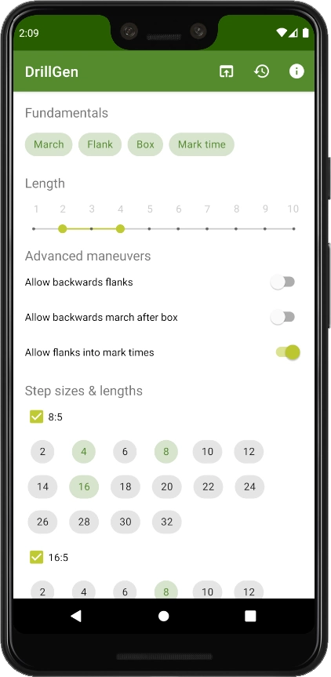

= DrillGen

DrillGen is designed to generate marching band drills at varying levels of difficulty. Its results are seen in the book _Haslett Viking Marching Band Master Handbook_.

This repository contains the source code for the library that generates drills. I've turned this into an app you can download from the Play Store.

[link=https://play.google.com/store/apps/details?id=org.wysko.drillgen]

[link=https://play.google.com/store/apps/details?id=org.wysko.drillgen]
image::https://play.google.com/intl/en_us/badges/static/images/badges/en_badge_web_generic.png[Get it on Google Play, 200]

The DrillGen library--the contents of this repository--is licensed under the MIT License.
